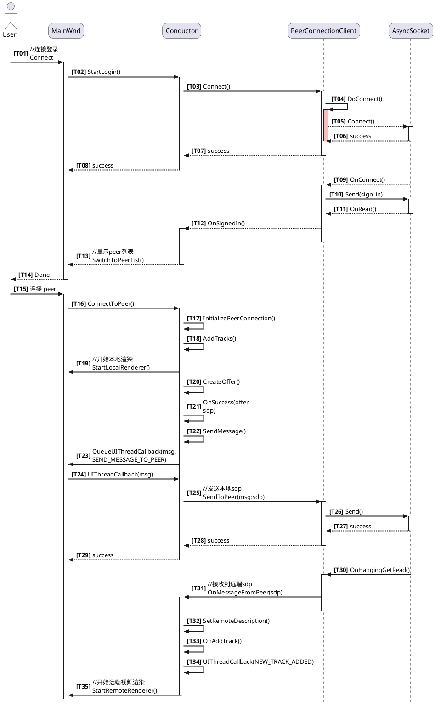
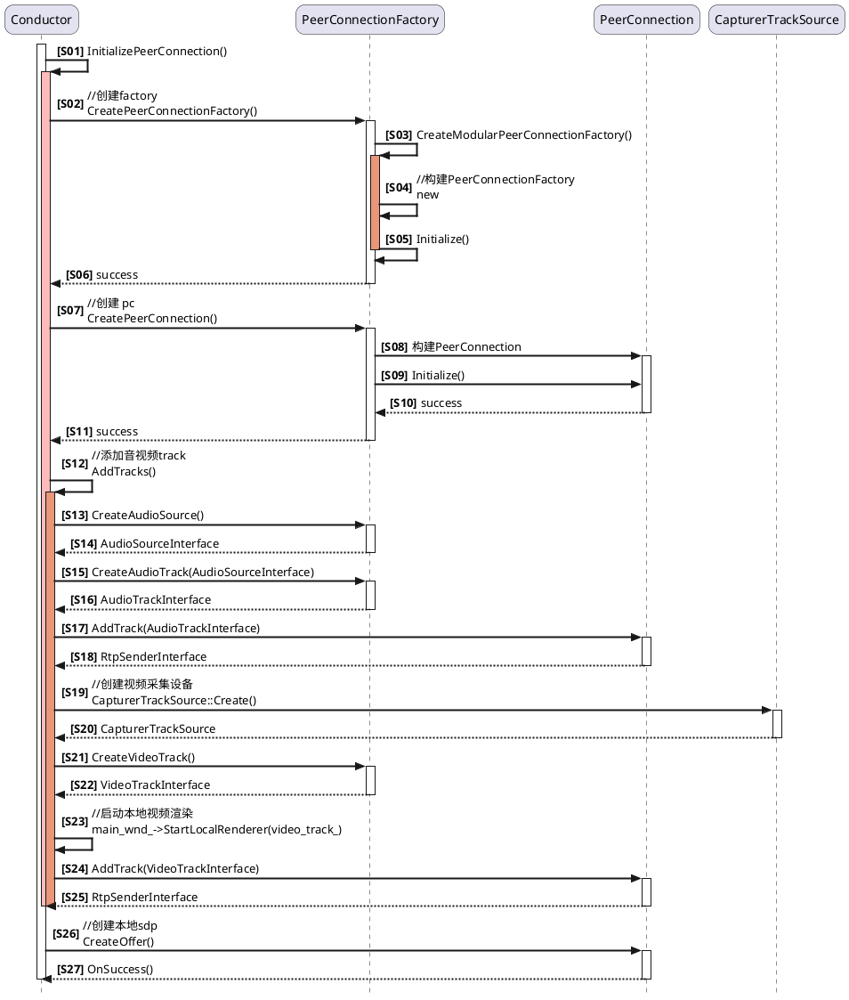
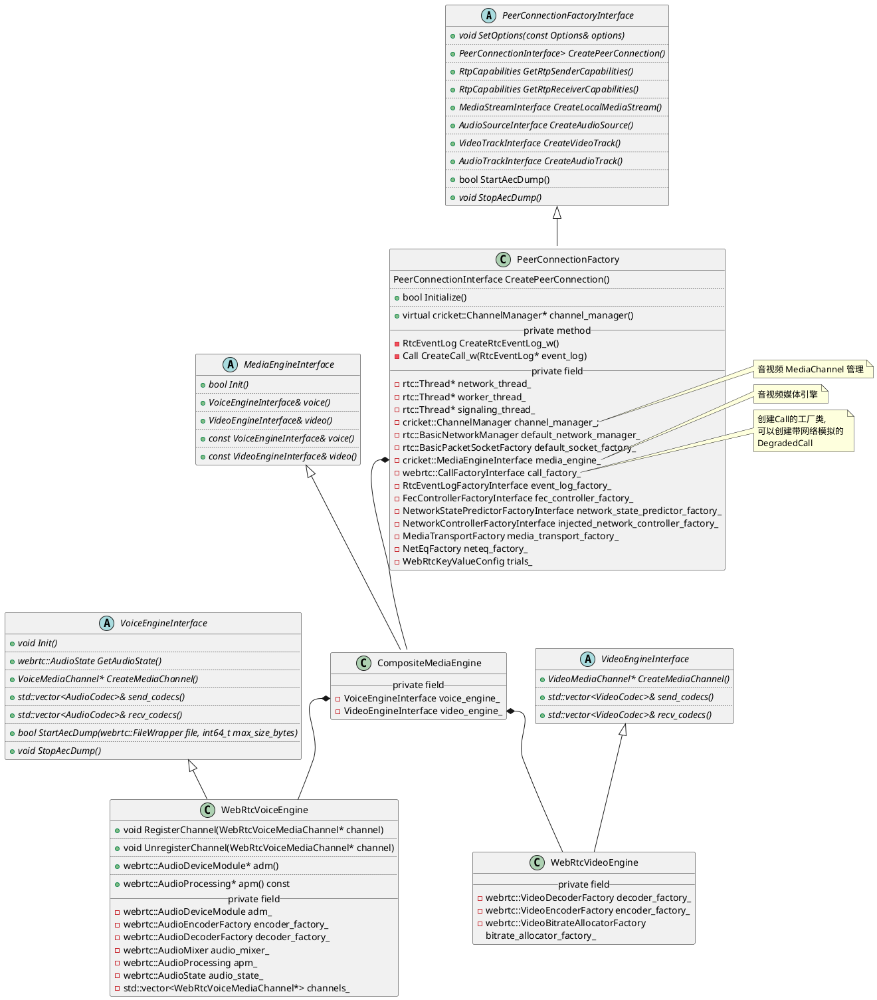
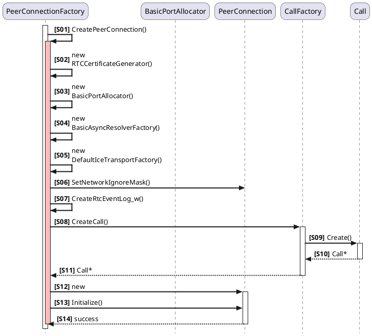
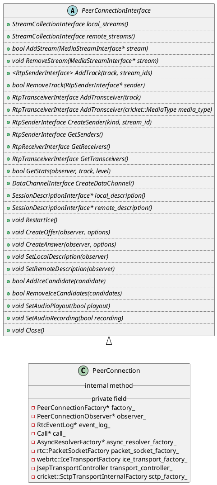

<!--
    请使用 Microsoft Visual Code 打开，需安装 PlantUML 扩展；另需安装 Java(jre) 环境（配置JAVA_HOME）及 graphviz 软件。
-->
# WebRTC 源码分析
[TOC]

该文章所述逻辑及代码分析基于 Windows平台 WebRTC m84(branch-heads/4147)分支，若文章中有所述错误，欢迎留言指正。

## 1 PeerConnectionClient 简述
Windows 平台的demo 代码在 examples\peerconnection\client 目录:
```c++
examples\peerconnection\client
    |-- main.cc // 程序入口
    |-- main_wnd.cc // UI 及视频渲染处理
    |-- conductor.cc // PeerConnection 交互，是 MainWnd和PeerConnectionClient的观察者，或者可以说是这两者的中间层
    |-- peer_connection_client.cc // http 信令交互
```
demo 层主动连接基本调用如下：
- a. 先连接到服务器，获取到所有peer 列表;
- b. 双击peer列表中选定的一条进行建立pc连接;
  


## 2 PeerConnection 建立过程介绍
WebRTC 中一个基本的 PeerConnection 使用需要协调本地机器以及远端机器的连接，它可以通过在两台机器间生成Session Description的数据交换协议来实现。呼叫方发送一个offer(请求)，被呼叫方发出一个answer（应答）来回答请求。双方-呼叫方以及被呼叫方，最开始的时候都要建立他们各自的 PeerConnection 对象。

### 2.1 基本流程
PeerConnection 的创建从 [PeerConnectionClient 简述](#1-peerconnectionclient-简述) 的 T17 所述函数 InitializePeerConnection() 开始：


源码分析：
```c++
/* 创建并初始化 peer connection */
bool Conductor::InitializePeerConnection()
{
    /* 创建 PeerConnectionFactory */
    peer_connection_factory_ = webrtc::CreatePeerConnectionFactory(
      nullptr /* network_thread */, nullptr /* worker_thread */,
      nullptr /* signaling_thread */, nullptr /* default_adm */,
      webrtc::CreateBuiltinAudioEncoderFactory(),
      webrtc::CreateBuiltinAudioDecoderFactory(),
      webrtc::CreateBuiltinVideoEncoderFactory(),
      webrtc::CreateBuiltinVideoDecoderFactory(), nullptr /* audio_mixer */,
      nullptr /* audio_processing */);

    /* 创建 peer connection */
    CreatePeerConnection(/*dtls=*/true);

    /* 创建音频及视频 source 和 track */
    AddTracks();
}
```

### 2.2 创建及初始化 PeerConnectionFactory
源码分析：
```c++
// api/create_peerconnection_factory.cc
rtc::scoped_refptr<PeerConnectionFactoryInterface> CreatePeerConnectionFactory(
    rtc::Thread* network_thread,
    rtc::Thread* worker_thread,
    rtc::Thread* signaling_thread,
    rtc::scoped_refptr<AudioDeviceModule> default_adm,
    rtc::scoped_refptr<AudioEncoderFactory> audio_encoder_factory,
    rtc::scoped_refptr<AudioDecoderFactory> audio_decoder_factory,
    std::unique_ptr<VideoEncoderFactory> video_encoder_factory,
    std::unique_ptr<VideoDecoderFactory> video_decoder_factory,
    rtc::scoped_refptr<AudioMixer> audio_mixer,
    rtc::scoped_refptr<AudioProcessing> audio_processing)
{
    PeerConnectionFactoryDependencies dependencies;
    dependencies.network_thread = network_thread;
    dependencies.worker_thread = worker_thread;
    dependencies.signaling_thread = signaling_thread;
    /* 创建任务队列工厂类 */
    dependencies.task_queue_factory = CreateDefaultTaskQueueFactory();
    /* 创建 Call 工厂类 */
    dependencies.call_factory = CreateCallFactory();
    /* 创建事件日志工厂类 */
    dependencies.event_log_factory = std::make_unique<RtcEventLogFactory>(
        dependencies.task_queue_factory.get());

    /* 媒体引擎依赖模块创建 */
    cricket::MediaEngineDependencies media_dependencies;
    media_dependencies.task_queue_factory = dependencies.task_queue_factory.get();
    media_dependencies.adm = std::move(default_adm);
    media_dependencies.audio_encoder_factory = std::move(audio_encoder_factory);
    media_dependencies.audio_decoder_factory = std::move(audio_decoder_factory);
    if (audio_processing) {
        media_dependencies.audio_processing = std::move(audio_processing);
    } else {
        /* 创建音频处理模块 */
        media_dependencies.audio_processing = AudioProcessingBuilder().Create();
    }
    media_dependencies.audio_mixer = std::move(audio_mixer);
    media_dependencies.video_encoder_factory = std::move(video_encoder_factory);
    media_dependencies.video_decoder_factory = std::move(video_decoder_factory);
    /* 创建音视频媒体引擎 */
    dependencies.media_engine =
        cricket::CreateMediaEngine(std::move(media_dependencies));

    return CreateModularPeerConnectionFactory(std::move(dependencies));
}

// pc/peer_connection_factory.cc
rtc::scoped_refptr<PeerConnectionFactoryInterface>
CreateModularPeerConnectionFactory(
    PeerConnectionFactoryDependencies dependencies) {
    /* 构建 PeerConnectionFactory 对象 */
    rtc::scoped_refptr<PeerConnectionFactory> pc_factory(
        new rtc::RefCountedObject<PeerConnectionFactory>(
            std::move(dependencies)));
    // Call Initialize synchronously but make sure it is executed on
    // |signaling_thread|.
    /* 初始化 PeerConnectionFactory 对象，创建三个主要工作线程：network_thread_， worker_thread_， signaling_thread_ */
    MethodCall<PeerConnectionFactory, bool> call(
        pc_factory.get(), &PeerConnectionFactory::Initialize);
    bool result = call.Marshal(RTC_FROM_HERE, pc_factory->signaling_thread());

    if (!result) {
        return nullptr;
    }
    return PeerConnectionFactoryProxy::Create(pc_factory->signaling_thread(), pc_factory);
}

bool PeerConnectionFactory::Initialize()
{
    /* 初始化随机数种子 */
    rtc::InitRandom(rtc::Time32());

    /* 设备网络设备管理，获取网卡及本地地址等 */
    default_network_manager_.reset(new rtc::BasicNetworkManager());
    if (!default_network_manager_) {
        return false;
    }

    /* 构建 TCP及UDP socket 工厂类 */
    default_socket_factory_.reset(
        new rtc::BasicPacketSocketFactory(network_thread_));
    if (!default_socket_factory_) {
        return false;
    }

    /* 构建媒体通道管理 */
    channel_manager_ = std::make_unique<cricket::ChannelManager>(
        std::move(media_engine_), std::make_unique<cricket::RtpDataEngine>(), worker_thread_, network_thread_);

    /* 默认使能视频 RTX, 必须在 Init() 之前调用 */
    channel_manager_->SetVideoRtxEnabled(true);
    /* 初始化音视频媒体引擎 */
    if (!channel_manager_->Init()) {
        return false;
    }

    return true;
}

// pc/channel_manager.cc
bool ChannelManager::Init()
{
    if (!network_thread_->IsCurrent()) {
        // Do not allow invoking calls to other threads on the network thread.
        /* 关闭 network 线程阻塞式调用 */
        network_thread_->Invoke<void>(
            RTC_FROM_HERE, [&] { network_thread_->DisallowBlockingCalls(); });
    }

    /* 在 worker 线程初始化媒体引擎 */
    worker_thread_->Invoke<bool>(
        RTC_FROM_HERE, [&] { return media_engine_->Init(); });
}

// media/base/media_engine.cc
bool CompositeMediaEngine::Init()
{
    voice().Init();
    return true;
}

// media/engine/webrtc_voice_engine.cc
void WebRtcVoiceEngine::Init()
{
    // TaskQueue expects to be created/destroyed on the same thread.
    low_priority_worker_queue_.reset(
        new rtc::TaskQueue(task_queue_factory_->CreateTaskQueue(
            "rtc-low-prio", webrtc::TaskQueueFactory::Priority::LOW)));
    
    // Load our audio codec lists.
    send_codecs_ = CollectCodecs(encoder_factory_->GetSupportedEncoders());
    recv_codecs_ = CollectCodecs(decoder_factory_->GetSupportedDecoders());

    /* 音频设备构建，如果创建PeerConnectionFactory时没传入音频设备对象，
     * 则会在此创建 */
    if (!adm_) {
        adm_ = webrtc::AudioDeviceModule::Create(
            webrtc::AudioDeviceModule::kPlatformDefaultAudio, task_queue_factory_);
    }

    /* 初始化音频设备 */
    webrtc::adm_helpers::Init(adm());

    // Set up AudioState.
    {
        webrtc::AudioState::Config config;
        /* 创建音频混音模块 */
        if (audio_mixer_) {
            config.audio_mixer = audio_mixer_;
        } else {
            config.audio_mixer = webrtc::AudioMixerImpl::Create();
        }
        config.audio_processing = apm_;
        config.audio_device_module = adm_;
        /* 构建 AudioState，用于在不同对象之间的音频状态共享，有些类似于旧版本的 SharedData */
        audio_state_ = webrtc::AudioState::Create(config);
    }

    // Connect the ADM to our audio path.
    /* 音频设备数据回调注册 */
    adm()->RegisterAudioCallback(audio_state()->audio_transport());

    // Set default engine options.
    {
        AudioOptions options;
        options.echo_cancellation = true;
        options.auto_gain_control = true;
        options.noise_suppression = true;
        options.highpass_filter = true;
        options.stereo_swapping = false;
        options.audio_jitter_buffer_max_packets = 200;
        options.audio_jitter_buffer_fast_accelerate = false;
        options.audio_jitter_buffer_min_delay_ms = 0;
        options.audio_jitter_buffer_enable_rtx_handling = false;
        options.typing_detection = true;
        options.experimental_agc = false;
        options.experimental_ns = false;
        options.residual_echo_detector = true;
        bool error = ApplyOptions(options);
        RTC_DCHECK(error);
    }
}
```

类图：


### 2.3 创建 PeerConnection


源码分析：

```C++
bool Conductor::CreatePeerConnection(bool dtls)
{
    RTC_DCHECK(peer_connection_factory_);
    RTC_DCHECK(!peer_connection_);

    webrtc::PeerConnectionInterface::RTCConfiguration config;
    /* 所使用的Sdp 语义模式 */
    config.sdp_semantics = webrtc::SdpSemantics::kUnifiedPlan;
    /* 是否使用加密 */
    config.enable_dtls_srtp = dtls;
    /* ICE 服务器配置 */
    webrtc::PeerConnectionInterface::IceServer server;
    server.uri = GetPeerConnectionString();
    config.servers.push_back(server);

    /* 创建 PeerConnection */
    peer_connection_ = peer_connection_factory_->CreatePeerConnection(
        config, nullptr/*PortAllocator*/, 
        nullptr/*RTCCertificateGeneratorInterface*/,         
        this/* PeerConnectionObserver 监听对象 */);

    return peer_connection_ != nullptr;
}

// pc/peer_connection_factory.cc
rtc::scoped_refptr<PeerConnectionInterface>
PeerConnectionFactory::CreatePeerConnection(
    const PeerConnectionInterface::RTCConfiguration& configuration,
    PeerConnectionDependencies dependencies) {
    
    ...

    // Set internal defaults if optional dependencies are not set.
    /* 创建证书生成器 */
    if (!dependencies.cert_generator) {
        dependencies.cert_generator =
            std::make_unique<rtc::RTCCertificateGenerator>(signaling_thread_, network_thread_);
    }
    if (!dependencies.allocator) {
        rtc::PacketSocketFactory* packet_socket_factory;
        if (dependencies.packet_socket_factory)
            packet_socket_factory = dependencies.packet_socket_factory.get();
        else
            /* 使用 PeerConnectionFactory::Initialize() 创建的 socket 工厂 */
            packet_socket_factory = default_socket_factory_.get();

        /* 在 network 线程创建 BasicPortAllocator，与 ICE 相关 */
        network_thread_->Invoke<void>(RTC_FROM_HERE, [this, &configuration,
                                                    &dependencies,
                                                    &packet_socket_factory]() {
        dependencies.allocator = std::make_unique<cricket::BasicPortAllocator>(
            default_network_manager_.get(), packet_socket_factory,
            configuration.turn_customizer);
        });
    }

    if (!dependencies.async_resolver_factory) {
        /* 创建异步域名解析工厂 */
        dependencies.async_resolver_factory =
            std::make_unique<webrtc::BasicAsyncResolverFactory>();
    }

    if (!dependencies.ice_transport_factory) {
        /* 创建 ICE 通道工厂 */
        dependencies.ice_transport_factory =
            std::make_unique<DefaultIceTransportFactory>();
    }

    network_thread_->Invoke<void>(
        RTC_FROM_HERE,
        rtc::Bind(&cricket::PortAllocator::SetNetworkIgnoreMask,
                    dependencies.allocator.get(), options_.network_ignore_mask));

    /* 创建 EventLog */
    std::unique_ptr<RtcEventLog> event_log =
        worker_thread_->Invoke<std::unique_ptr<RtcEventLog>>(
            RTC_FROM_HERE,
            rtc::Bind(&PeerConnectionFactory::CreateRtcEventLog_w, this));

    /* worker 线程创建 Call */
    std::unique_ptr<Call> call = worker_thread_->Invoke<std::unique_ptr<Call>>(
        RTC_FROM_HERE,
        rtc::Bind(&PeerConnectionFactory::CreateCall_w, this, event_log.get()));

    /* 创建PeerConnection对象 */
    rtc::scoped_refptr<PeerConnection> pc(
        new rtc::RefCountedObject<PeerConnection>(this, std::move(event_log),
                                                    std::move(call)));
    ActionsBeforeInitializeForTesting(pc);
    if (!pc->Initialize(configuration, std::move(dependencies))) {
        return nullptr;
    }
    return PeerConnectionProxy::Create(signaling_thread(), pc);
}

std::unique_ptr<Call> PeerConnectionFactory::CreateCall_w(
    RtcEventLog* event_log)
{
  RTC_DCHECK_RUN_ON(worker_thread_);

    ...

    webrtc::Call::Config call_config(event_log);
    call_config.audio_state =
        channel_manager_->media_engine()->voice().GetAudioState();

    /* 读取配置的码率配置 */
    FieldTrialParameter<DataRate> min_bandwidth("min",
                                                DataRate::KilobitsPerSec(30));
    FieldTrialParameter<DataRate> start_bandwidth("start",
                                                    DataRate::KilobitsPerSec(300));
    FieldTrialParameter<DataRate> max_bandwidth("max",
                                                DataRate::KilobitsPerSec(2000));
    ParseFieldTrial({&min_bandwidth, &start_bandwidth, &max_bandwidth},
                    trials_->Lookup("WebRTC-PcFactoryDefaultBitrates"));

    call_config.bitrate_config.min_bitrate_bps =
        rtc::saturated_cast<int>(min_bandwidth->bps());
    call_config.bitrate_config.start_bitrate_bps =
        rtc::saturated_cast<int>(start_bandwidth->bps());
    call_config.bitrate_config.max_bitrate_bps =
        rtc::saturated_cast<int>(max_bandwidth->bps());

    call_config.fec_controller_factory = fec_controller_factory_.get();
    call_config.task_queue_factory = task_queue_factory_.get();
    call_config.network_state_predictor_factory =
        network_state_predictor_factory_.get();
    call_config.neteq_factory = neteq_factory_.get();

    if (IsTrialEnabled("WebRTC-Bwe-InjectedCongestionController")) {
        RTC_LOG(LS_INFO) << "Using injected network controller factory";
        call_config.network_controller_factory =
            injected_network_controller_factory_.get();
    } else {
        RTC_LOG(LS_INFO) << "Using default network controller factory";
    }

    call_config.trials = trials_.get();

    return std::unique_ptr<Call>(call_factory_->CreateCall(call_config));
}

// call/call.cc
Call* Call::Create(const Call::Config& config)
{
    /* 此处创建了一个模块定时轮询线程和 Pacer 线程 */
    return Create(config, Clock::GetRealTimeClock(),
                    ProcessThread::Create("ModuleProcessThread"),
                    ProcessThread::Create("PacerThread"));
}

Call* Call::Create(const Call::Config& config,
                   Clock* clock,
                   std::unique_ptr<ProcessThread> call_thread,
                   std::unique_ptr<ProcessThread> pacer_thread)
{
    RTC_DCHECK(config.task_queue_factory);
    return new internal::Call(
        clock, config,
        /* 创建 RtpTransportControllerSend 对象 */
        std::make_unique<RtpTransportControllerSend>(
            clock, config.event_log, config.network_state_predictor_factory,
            config.network_controller_factory, config.bitrate_config,
            std::move(pacer_thread), config.task_queue_factory, config.trials),
        std::move(call_thread), config.task_queue_factory);
}

// pc/peer_conection.cc
PeerConnection::PeerConnection(PeerConnectionFactory* factory,
                               std::unique_ptr<RtcEventLog> event_log,
                               std::unique_ptr<Call> call)
    : factory_(factory),
      event_log_(std::move(event_log)),
      event_log_ptr_(event_log_.get()),
      operations_chain_(rtc::OperationsChain::Create()),
      datagram_transport_config_(
          field_trial::FindFullName(kDatagramTransportFieldTrial)),
      datagram_transport_data_channel_config_(
          field_trial::FindFullName(kDatagramTransportDataChannelFieldTrial)),
      rtcp_cname_(GenerateRtcpCname()),
      local_streams_(StreamCollection::Create()),
      remote_streams_(StreamCollection::Create()),
      call_(std::move(call)),
      call_ptr_(call_.get()),
      local_ice_credentials_to_replace_(new LocalIceCredentialsToReplace()),
      data_channel_controller_(this),
      weak_ptr_factory_(this) {}

bool PeerConnection::Initialize(
    const PeerConnectionInterface::RTCConfiguration& configuration,
    PeerConnectionDependencies dependencies)
{
    ...

    observer_ = dependencies.observer;
    async_resolver_factory_ = std::move(dependencies.async_resolver_factory);
    port_allocator_ = std::move(dependencies.allocator);
    packet_socket_factory_ = std::move(dependencies.packet_socket_factory);
    ice_transport_factory_ = std::move(dependencies.ice_transport_factory);
    tls_cert_verifier_ = std::move(dependencies.tls_cert_verifier);

    /* ICE 服务器地址解析 */
    cricket::ServerAddresses stun_servers;
    std::vector<cricket::RelayServerConfig> turn_servers;

    RTCErrorType parse_error =
        ParseIceServers(configuration.servers, &stun_servers, &turn_servers);

    // The port allocator lives on the network thread and should be initialized
    // there.
    /* ICE 相关 Port 初始化 */
    const auto pa_result =
        network_thread()->Invoke<InitializePortAllocatorResult>(
            RTC_FROM_HERE,
            rtc::Bind(&PeerConnection::InitializePortAllocator_n, this,
                        stun_servers, turn_servers, configuration));

    JsepTransportController::Config config;
    config.redetermine_role_on_ice_restart = configuration.redetermine_role_on_ice_restart;
    config.ssl_max_version = factory_->options().ssl_max_version;
    config.disable_encryption = options.disable_encryption;
    config.bundle_policy = configuration.bundle_policy;
    config.rtcp_mux_policy = configuration.rtcp_mux_policy;
    config.transport_observer = this;
    config.rtcp_handler = [this](const rtc::CopyOnWriteBuffer& packet,
                               int64_t packet_time_us) { ... }
    
    ...
    /* Sdp 及 ICE 相关封装，Sdp 协商，通道选择等，将相关事件通过信号槽回调给 PeerConnection */
    transport_controller_.reset(new JsepTransportController(
        signaling_thread(), network_thread(), port_allocator_.get(),
        async_resolver_factory_.get(), config));

    /* JsepTransportController 信号槽配置 */
    transport_controller_->SignalIceConnectionState.connect(
      this, &PeerConnection::OnTransportControllerConnectionState);
    transport_controller_->SignalStandardizedIceConnectionState.connect(
        this, &PeerConnection::SetStandardizedIceConnectionState);
    transport_controller_->SignalConnectionState.connect(
        this, &PeerConnection::SetConnectionState);
    transport_controller_->SignalIceGatheringState.connect(
        this, &PeerConnection::OnTransportControllerGatheringState);
    transport_controller_->SignalIceCandidatesGathered.connect(
        this, &PeerConnection::OnTransportControllerCandidatesGathered);
    transport_controller_->SignalIceCandidateError.connect(
        this, &PeerConnection::OnTransportControllerCandidateError);
    transport_controller_->SignalIceCandidatesRemoved.connect(
        this, &PeerConnection::OnTransportControllerCandidatesRemoved);
    transport_controller_->SignalDtlsHandshakeError.connect(
        this, &PeerConnection::OnTransportControllerDtlsHandshakeError);
    transport_controller_->SignalIceCandidatePairChanged.connect(
        this, &PeerConnection::OnTransportControllerCandidateChanged);

    stats_.reset(new StatsCollector(this));
    stats_collector_ = RTCStatsCollector::Create(this);

    transport_controller_->SetIceConfig(ParseIceConfig(configuration));

    /* 构建 Sdp 生成工厂 */
    webrtc_session_desc_factory_.reset(new WebRtcSessionDescriptionFactory(
        signaling_thread(), channel_manager(), this, session_id(),
        std::move(dependencies.cert_generator), certificate, &ssrc_generator_));
    webrtc_session_desc_factory_->SignalCertificateReady.connect(
        this, &PeerConnection::OnCertificateReady);
    /* 设置 Sdp 协商模式 */
    webrtc_session_desc_factory_->set_is_unified_plan(IsUnifiedPlan());

    // Add default audio/video transceivers for Plan B SDP.
    if (!IsUnifiedPlan()) {
        transceivers_.push_back(
            RtpTransceiverProxyWithInternal<RtpTransceiver>::Create(
                signaling_thread(), new RtpTransceiver(cricket::MEDIA_TYPE_AUDIO)));
        transceivers_.push_back(
            RtpTransceiverProxyWithInternal<RtpTransceiver>::Create(
                signaling_thread(), new RtpTransceiver(cricket::MEDIA_TYPE_VIDEO)));
    }

    if (dependencies.video_bitrate_allocator_factory) {
        video_bitrate_allocator_factory_ =
            std::move(dependencies.video_bitrate_allocator_factory);
    } else {
        video_bitrate_allocator_factory_ =
            CreateBuiltinVideoBitrateAllocatorFactory();
    }
    return true;
}
```

类图：(部分类成员仅摘录了部分，完整的请自查代码)

